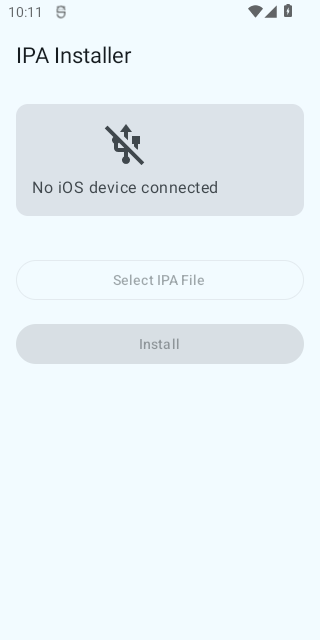

# IPA Installer for Android

Android app that installs IPA files (iOS apps) onto iPhone/iPad via USB OTG cable — **no root required**.

[](https://github.com/andreevym/app-android-ipa-installer/actions/workflows/build.yml)
[](https://github.com/andreevym/app-android-ipa-installer/actions/workflows/test-emulator.yml)

## Screenshot

<p align="center">
  
</p>

## What it does

Connect your iPhone to your Android phone via USB OTG, select an IPA file, and install it directly — all without root access on Android.

Unlike similar projects (e.g. [OTGLocation](https://github.com/cczhr/OTGLocation)) that require root to run native `usbmuxd`/`libimobiledevice` binaries, this app implements all Apple protocols in pure Kotlin using Android's USB Host API.

## How it works

```
Android App (Kotlin)
    ├── Android USB Host API (no root)
    ├── usbmuxd — TCP multiplexing over USB
    ├── lockdownd — device pairing, service start
    ├── AFC — file upload to iOS staging area
    └── installation_proxy — IPA installation
```

## Requirements

- Android 7.0+ (API 24) with USB Host (OTG) support
- USB OTG adapter/cable
- iOS device (iPhone, iPad)
- IPA file with valid signature (developer, ad-hoc, or enterprise)

## Download

Get the latest APK from [Releases](https://github.com/andreevym/app-android-ipa-installer/releases).

## Usage

1. Install the APK on your Android device
2. Connect iPhone via USB OTG cable
3. Grant USB permission when prompted
4. Tap "Trust This Computer" on iPhone
5. Select an IPA file
6. Tap "Install"

## Build

```bash
# Debug APK
./gradlew assembleDebug

# Run tests
./gradlew test

# Lint
./gradlew lint
```

## Tech Stack

| Component | Technology |
|-----------|-----------|
| Language | Kotlin 2.1 |
| UI | Jetpack Compose + Material 3 |
| DI | Hilt |
| Crypto | BouncyCastle (iOS TLS pairing) |
| Plist | dd-plist |
| Architecture | MVVM + Coroutines/Flow |
| Min SDK | 24 (Android 7.0) |
| Target SDK | 35 (Android 15) |

## Documentation

- [Architecture](docs/architecture.md) — protocol details and component design
- [TODO](docs/TODO.md) — known issues and roadmap

## Known Limitations

- TLS session upgrade not yet implemented — pairing will fail at `startService`
- Requires USB OTG adapter to force Android into USB host mode

## Credits

- [OTGLocation](https://github.com/cczhr/OTGLocation) — reference project for Android-iOS USB communication
- [libimobiledevice](https://github.com/libimobiledevice/libimobiledevice) — reference C implementation of Apple protocols
- [pymobiledevice3](https://github.com/doronz88/pymobiledevice3) — Python implementation (excellent protocol reference)

## License

GPL-3.0 — see [LICENSE](LICENSE) for details.
